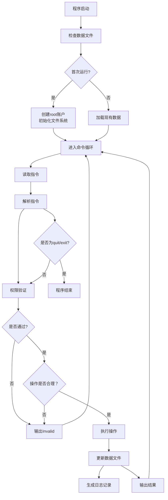
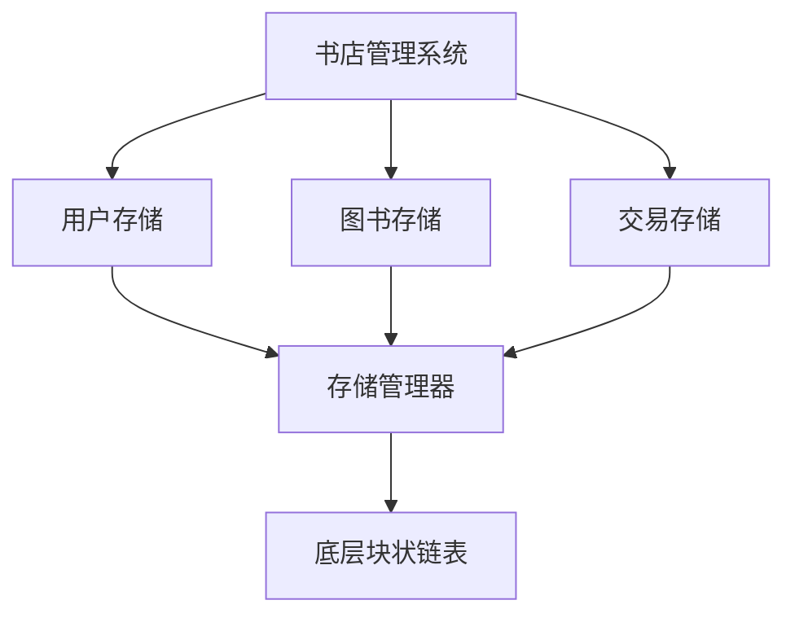

**项目名称：BookStore**

**文档作者：单立铖**

**一、程序功能概述**
```
    BookStore是一个用c++语言模拟的、基于命令行交互的书店管理系统。具体来说，它支持以下功能：

·账户管理：用户注册、登录、权限控制
·图书管理：图书信息存储、索引记录、图书查询、进货、购买
·交易管理：进货记录、销售记录、日志记录
·日志管理：操作日志、员工报告、系统报告
·文件存储
```

**二、主体逻辑说明**

**（1）程序运行的基本流程**


**（2）块状链表存储架构**


**三、代码文件结构**

**（1）文件结构**

(画图时借助了AI)
```
bookstore/
├── main.cpp
├── command.h
├── command.cpp
├── storage.h
├── storage.cpp
├── user.h
├── user.cpp
├── book.h
├── book.cpp
├── transaction.h
├── transaction.cpp
├── utils.h
├── utils.cpp
├── BlockListDB.h
├── BlockListDB.cpp
└── Makefile
```

**（2）main函数大致设计**
```
#include <iostream>
#include <string>
#include "storage.h"
#include "command.h"
#include "user.h"
#include "book.h"
#include "transaction.h"

int main() {
    // 初始化存储系统
    Storage storage;
    if (!storage.initialize()) {
        std::cout << "初始化失败" << std::endl;
        return 1;
    }
    
    // 创建系统状态
    SystemState state;
    
    // 主循环
    std::string line;
    while (getline(std::cin, line)) {
        if (line.empty()) continue;
        
        // 解析命令
        ParsedCommand cmd = parseCommand(line);
        if (!cmd.valid) {
            std::cout << "Invalid" << std::endl;
            continue;
        }
        
        // 执行命令
        bool success = execute(cmd, storage, state);
        if (!success) {
            std::cout << "Invalid" << std::endl;
        }
        
        // 检查退出
        if (cmd.name == "quit" || cmd.name == "exit") {
            break;
        }
    }
    
    return 0;
}
```

**四、功能设计**

**（p.s.功能描述中的“输入”指指令对应的具体信息，不包含指令名本身）**

```
模块1：索引存储模块
    功能描述：管理图书信息的索引文件
    1.创建索引
        输入：数据文件
        输出：索引文件
        处理：为数据文件创建块状链表索引
    2.更新索引
        输入：数据变更
        输出：无输出
        处理：更新索引文件
    3.查询索引
        输入：查询键值
        输出：数据位置
        处理：在索引中查找对应记录的位置

模块2：用户管理模块
    功能描述：处理用户注册、登录、权限管理
    1.用户注册
        输入：用户ID，用户名，密码（默认为顾客）
        输出：注册成功/失败
        处理：检查用户ID是否唯一，若创建成功则记录
    2.用户登录
        输入：用户ID，用户名，密码
        输出：登录成功/失败，用户类型
        处理：验证用户是否存在、密码是否正确（高级用户无需密码）， 更新用户状态
    3.用户创建（店员、店长）
        输入：用户ID，用户名，用户类型，密码
        输出：创建成功/失败
        处理：检查创建者权限、检查用户ID是否唯一，创建新用户
    4.用户登出
        输入：无
        输出：登出成功/失败
        处理：验证是否有已登录的账户，登出登录栈中最后一位
    5.用户删除
        输入：用户ID
        输出：删除成功/失败
        处理：检查用户是否存在、是否已登录，若删除成功则更新状态
    
模块3：图书管理模块
    功能描述：管理图书信息
    1.图书信息录入
        输入：图书完整信息（ISBN、书名、作者、关键词、库存、售价）
        输出：添加成功/失败
        处理：检查操作者权限、检查ISBN是否唯一，若添加成功则记录
    2.图书信息修改
        输入：ISBN，要修改的信息及新的值
        输出：修改成功/失败
        处理：检查操作者权限，查找图书，更新指定部分信息
    3.图书信息查询
        输入：查询条件（ISBN、书名、作者、关键词的组合）
        输出：符合条件的图书信息列表
        处理：根据条件检索索引文件

模块4：交易管理模块
    功能描述：处理图书的进货和购买操作、管理财务数据并供店长查询采购和销售情况、记录操作日志并生成工作报告
    1.进货操作
        输入：ISBN，进货数量，进货单价
        输出：进货成功/失败
        处理：检查操作者权限，查找图书，更新图书信息中库存部分，生成进货记录
    2.购买操作
        输入：ISBN，购买数量
        输出：购买成功/失败，购买详情（包括总价）
        处理：查找图书，检查库存是否足够，更新库存，生成销售记录
    3.查询财务记录
        输入：交易笔数（可选）
        输出：最后完成的指定笔数交易总额，格式为 + [收入] - [支出]
        处理：查询最近的交易记录，统计收入（销售）和支出（进货）
    4.生成财务报告
        输入：无
        输出：一张（并非）赏心悦目的财务报表
        处理：从交易记录中读取所有交易，生成格式化的财务报表
    5.生成全体员工工作情况报告
        输入：无
        输出：一张（并非）赏心悦目的员工工作情况表，记录其操作
        处理：从日志文件中读取日志记录，生成格式化的员工工作情况表
    6.记录操作日志
        输入：用户名，操作类型，操作对象，操作详情
        输出：无
        处理：写入日志文件
    7.生成日志
        输入：无
        输出：日志记录，包括系统操作和财务交易情况
        处理：从日志文件中读取日志记录，生成格式化的系统日志
```

**五、数据库设计**

**（1）数据存储结构**
```
data/
├── users.db           # 用户数据库（块状链表）
├── books.db           # 图书数据库（块状链表）
├── transactions.db    # 交易数据库（块状链表）
├── selected.db        # 选中图书状态（简单文本）
├── login_stack.db     # 登录栈状态（简单文本）
└── finance.db         # 财务摘要（简单文本）
```

**（2）数据存储格式**
```
·用户存储格式
键格式：user:[用户ID]
值格式：[用户名] [密码] [权限] [状态]

·图书存储格式
键格式：book:[ISBN]
值格式：[书名] [作者] [关键字] [价格] [库存]

·交易存储格式
键格式：trans:[时间戳]-[交易ID]
值格式：[类型] [ISBN] [数量] [价格] [用户ID]
```

**六、类、结构体设计**

**（1）用户管理：user.h**
```
struct User{
    char id[31];  //用户ID
    char name[31];  //用户名
    char password[31];  //密码
    int privilege;  //权限，仅可能取0，1，3，7
    int state;  //状态(1为已登录，0为未登录，-1为已删除)
    User() : privilege(1), state(0) {}
    //序列化
    std::string serialize() const {
        return id + " " + name + " " + password + " " + to_string(privilege) + " " + to_string(state);
    }
    //反序列化
    static User deserialize(const std::string& data) {}
};

//用于用户管理
class UserManager{
private:
    BlockListDB user_db;  //用块状链表存储的用户数据库
public:
    //注册用户的函数
    //创建用户的函数
    //删除用户的函数
    //注销用户的函数
    //登录用户的函数
    //修改密码的函数
}；
```

**（2）图书管理：book.h**
```
struct Book{
    std::string isbn;
    std::string name;
    std::string author;
    vector<std::string> keywords;
    double price;
    int quantity;
    Book() : price(0.0), quantity(0) {}
    std::string serialize() const {
        std::ostringstream oss;
        oss << isbn << " " << name << " " << author << " ";
        for (size_t i = 0; i < keywords.size(); i++){
            if (i > 0) oss << ",";
            oss << keywords[i];
        }
        oss << " " << fixed << setprecision(2) << price << " " << quantity;
        return oss.str();
    }
    static Book deserialize(const std::string data) {}
};

class BookManager{
private:
    BlockListDB book_db;
public:
    //检索图书的函数
    //选择（含创建）图书的函数
    //修改图书信息的函数
    //进货的函数
    //购买的函数
}；
```

**（3）交易结构：transaction.h**
```
struct Transaction {
    std::string trans_id;
    std::string type;  //交易类型，buy/import
    std::string isbn;
    int quantity;
    double price;  //单价
    double total;  //总价
    std::string user_id;
    time_t timestamp;  //时间戳，便于生成财务报告和记录日志
    Transaction() : quantity(0), price(0.0), total(0.0), timestamp(0) {}
    std::string serialize() const {
        return trans_id + " " + type + " " + isbn + " " + to_string(quantity) + " "
            + to_string(price) + " " + to_string(total) + " " + user_id + " " + to_string(timestamp);
    }
    static Transaction deserialize(const std::string data) {}
};

class TransManager{
private:
    BlockListDB trans_db;
public:
    //查询财务记录的函数
    //生成财务记录报告的函数
    //生成全体员工工作情况报告的函数
    //生成日志的函数
}；
```

**（4）命令处理器：command.h**
```
struct ParsedCommand {
    std::string name;  //命令名
    vector<std::string> args;  //参数列表
    bool valid;  //是否有效
    ParsedCommand() : valid(false) {}
};

ParsedCommand parseCommand(const std::string& line);
bool execute(const ParsedCommand& cmd, Storage& storage, SystemState& state);

struct SystemState {
    //登录栈
    struct LoginEntry {
        std::string user_id;
        int privilege;
    };
    vector<LoginEntry> login_stack;

    bool should_exit;  //退出标志

    //获取当前用户权限
    int getCurrentPrivilege() const {
        if (!login_stack.empty()) return login_stack.back().privilege;
        return 0;  //游客
    }
    //获取当前用户ID
    std::string getCurrentUserId() const {
        if (!login_stack.empty()) return login_stack.back().user_id;
        return "";
    }
    //添加登录用户
    void pushLogin(const std::string& user_id, int privilege){
        LoginEntry entry = {user_id, privilege};
        login_stack.push_back(entry);
    }
    //删除登录用户
    bool popLogin(){
        if (！login_stack.empty()){
            login_stack.pop_back();
            return true;
        }
        return false;
    }
};
```

**（5）存储管理器：storage.h**
```
class BlockListDB {
private:
    std::string data_file;
    std::string index_file;
public:
    BlockListDB(const std::string& data_file, const std::string& index_file);
    ~BlockListDB();

    //基本操作
    bool insert(const std::string& key, const std::string& value);
    bool remove(const std::string& key);
    std::string find(const std::string& key);
    vector<pair<std::string, std::string>> find_all();  //索引时可能要用到
}；

class Storage {
private:
    BlockListDB user_db;
    BlockListDB book_db;
    BlockListDB trans_db;
public:
    Storage();
    ~Storage();

    //初始化
    bool initialize();

    //用户操作
    bool save_user(const User& user);
    bool load_user(const std::string& user_id, User& user);
    bool delete_user(const std::string& user_id);

    //图书操作
    bool save_book(const Book& book);
    bool load_book(const std::string& isbn, Book& book);
    vector<Book> getAllBooks();

    //交易操作
    bool save_transaction(const Transaction& trans);

    //状态保存
    bool save_state(const SystemState& state);
    bool load_state(SystemState& state);
}
```

**（6）工具仓库：utils.h（实现过程中可能会有所更改）**
```
// 字符串分割
vector<string> split_string(const string& str, char delimiter);

// 检查字符串是否只包含合法字符
bool is_valid_userid(const string& str);
bool is_valid_password(const string& str);
bool is_valid_isbn(const string& str);
bool is_valid_book_name(const string& str);
bool is_valid_author(const string& str);
bool is_valid_keyword(const string& str);

// 权限检查
bool check_privilege(int required, int current);

// 格式化输出
string format_double(double value);
string format_time(time_t timestamp);

// 生成唯一ID
string generate_id();
```