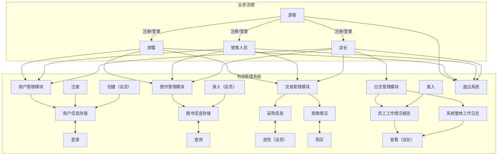
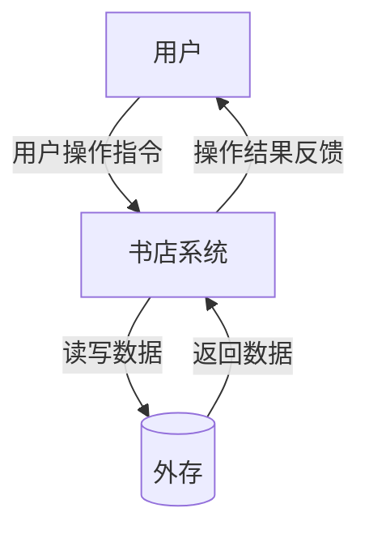
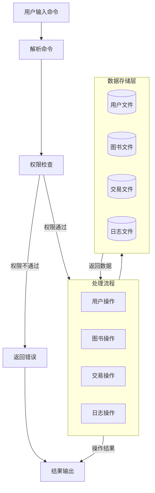
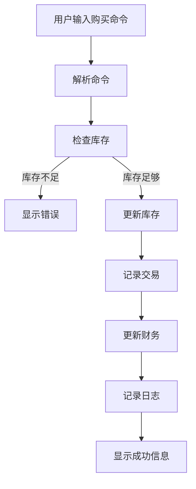

一、业务流图



二、数据流图
1.基本的数据流图



2.大致的数据流图



3.购买图书过程的数据流图



三、数据词典

```mermaid
flowchart TD
    DataDirectory[数据词典] --> UserData[用户数据]
    DataDirectory --> BookData[图书数据]
    DataDirectory --> TransData[交易数据]
    DataDirectory --> LogData[日志数据]
    UserData --> UserName[用户名（唯一标识）]
    UserData --> UserType[用户类型]
    UserData --> CreateTime[创建时间]
    BookData --> BookISBN[ISBN]
    BookData --> BookName[书名]
    BookData --> BookAuthor[作者名]
    BookData --> BookKeyword[关键词]
    BookData --> BookQuantity[库存量]
    BookData --> BookPrice[售价]
    BookData --> BookAddTime[添加时间]
    TransData --> TransName[交易者]
    TransData --> TransType[交易类型]
    TransData --> TransISBN[交易书号]
    TransData --> TransQuantity[交易量]
    TransData --> TransSinglePrice[交易单价]
    TransData --> TransTotalPrice[交易总价]
    TransData --> TransTime[交易时间]
    LogData --> LogName[用户名]
    LogData --> LogOperationType[操作类型]
    LogData --> LogOperationTarget[操作对象]
    LogData -.-> LogOperationDetail[操作详情，]

```



四、功能说明
```
模块1：用户管理模块
    功能描述：处理用户注册、登录、权限管理
    1.用户注册
        输入：用户名（默认为顾客）
        输出：注册成功/失败
        处理：检查用户名是否唯一，若创建成功则记录
    2.用户登录
        输入：用户名
        输出：登录成功/失败，用户类型
        处理：验证用户名是否存在，更新登录状态
    3.用户创建（店员、店长）
        输入：用户名，用户类型
        输出：创建成功/失败
        处理：检查创建者权限、检查用户名是否唯一，创建新用户
    
模块2：图书管理模块
    功能描述：管理图书信息
    1.图书信息录入
        输入：图书完整信息（ISBN、书名、作者、关键词、库存、售价）
        输出：添加成功/失败
        处理：检查操作者权限、检查ISBN是否唯一，若添加成功则记录
    2.图书信息修改
        输入：ISBN，要修改的信息及新的值
        输出：修改成功/失败
        处理：检查操作者权限，查找图书，更新指定部分信息
    3.图书信息查询
        输入：查询条件（ISBN、书名、作者、关键词的组合）
        输出：符合条件的图书信息列表
        处理：根据条件检索索引文件
    4.图书信息删除
        输入：ISBN
        输出：删除成功/失败
        处理：检查操作者权限，查找图书，若成功则标记删除，更新索引

模块3：索引管理模块
    功能描述：管理图书信息的索引文件
    1.创建索引
        输入：数据文件
        输出：索引文件
        处理：为数据文件创建块状链表索引
    2.更新索引
        输入：数据变更
        输出：无输出
        处理：更新索引文件
    3.查询索引
        输入：查询键值
        输出：数据位置
        处理：在索引中查找对应记录的位置

模块4：交易管理模块
    功能描述：处理图书的进货和购买操作
    1.进货操作
        输入：ISBN，进货数量，进货单价
        输出：进货成功/失败
        处理：检查操作者权限，查找图书，更新图书信息中库存部分，生成进货记录
    2.购买操作
        输入：ISBN，购买数量
        输出：购买成功/失败，购买详情（包括总价）
        处理：查找图书，检查库存是否足够，更新库存，生成销售记录
    3.生成进货报告
        输入：开始时间，结束时间
        输出：进货记录列表
        处理：根据时间范围查找进货记录
    4.生成销售报告
        输入：开始时间，结束时间
        输出：销售记录列表
        处理：根据时间范围查找销售记录

模块5：财务管理模块
    功能描述：管理财务数据并供店长查询采购和销售情况
    1.计算盈利信息
        输入：开始时间，结束时间
        输出：总收入、总支出、总利润
        处理：统计指定时间内的销售总额和采购总额
    2.查询采购情况
        输入：开始时间，结束时间
        输出：采购记录列表
        处理：汇总所有采购操作的数据
    3.查询销售情况
        输入：开始时间，结束时间
        输出：销售记录列表
        处理：汇总所有销售操作的数据

模块6：日志管理模块
    功能描述：记录操作日志并生成工作报告
    1.记录操作日志
        输入：用户名，操作类型，操作对象，操作详情
        输出：无输出
        处理：写入日志文件
    2.查询员工工作报告
        输入：用户名，开始时间，结束时间
        输出：员工操作记录列表
        处理：根据用户名和时间范围查询日志
    3.查询系统日志
        输入：开始时间，结束时间
        输出：系统所有操作记录列表
        处理：根据时间范围查询全部日志
```


五、用户交互设计
```
1.通用命令
    quit #退出系统
        输出：再见！
    help #显示帮助信息
        输出：显示帮助手册
            
2.用户管理命令
    register [username]  #注册新用户
        输出：用户“**”注册成功，权限：顾客 / 错误：用户名“**”已存在！
    useradd [username][privilege]  #创建用户
        输出：用户“**”创建成功，权限：**，创建者：** / 错误：权限不足！ / 错   误：用户“**”已存在！
    login [username]  #登录
        输出：用户“**”登录成功！ / 错误：用户名不存在！

3.图书管理命令
    add [ISBN][name][author][keywords][quantity][price]  #添加图书
        输出：图书“**”添加成功！ / 错误：ISBN“**”已存在！
    modify [ISBN][field][new_value]  #修改图书信息
        输出：图书“**”的“**”已修改！ /错误：权限不足！ / 错误：图书不存在！
    delete [ISBN]  #删除图书信息
        输出：图书“**”已删除！ / 错误：权限不足！ / 错误：图书不存在！

4.查询命令
    findbook -ISBN=[ISBN]
    findbook -name=[name]
    findbook -author=[author]
    findbook -keyword=[keyword]
    #支持组合查询
        输出：找到n本图书
             1.ISBN：**
               书名：**
               作者：**
               关键词：**
               库存：**
               价格：**
            2.······
            / 未找到匹配的图书！

5.交易命令
    import [ISBN][quantity][price]  #进货
        输出：进货完成！现有库存*本 / 错误：权限不足！ / 错误：图书不存在！
    buy [ISBN][quantity]  #购买
        输出：购买完成！ / 错误：库存不足！ / 错误：图书不存在！

6.报告命令
    report profit [start_time][end_time]  #盈利信息
    report sales [start_time][end_time]  #销售报告
    report purchase [start_time][end_time]  #采购报告
    report employee [username][start_time][end_time]  #员工工作报告
    report system [start_time][end_time]  #系统日志报告
```